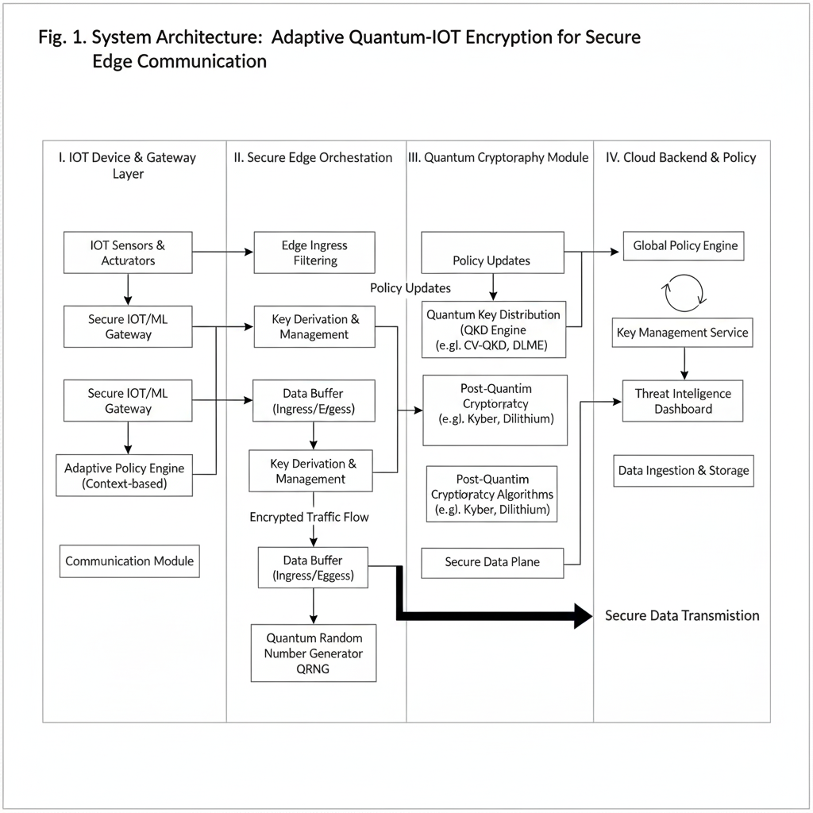

# Adaptive Quantum-IoT Encryption Framework

## Overview
Modern IoT systems move massive amounts of sensitive data, yet most still rely on long-lived cryptographic keys that quietly weaken over time. This project tackles that gap by integrating **quantum key distribution (BB84)** with **adaptive, entropy-driven security** for IoT communication.

Instead of treating encryption as a static layer, this framework makes security **self-adjusting**, using quantum-generated keys that evolve based on real-time randomness and system behavior.

---
## System Architecture

The following diagram illustrates the overall architecture of the Adaptive Quantum-IoT Encryption Framework, showing the interaction between IoT devices, QRNG-based key generation, adaptive entropy control, and cloud communication.



---

## Simulation Results

### QRNG Entropy Over Time

This graph shows the entropy values generated by the Quantum Random Number Generator (QRNG) over time.  
The entropy remains close to the ideal value of **1 bit**, validating the randomness and reliability of the quantum key source.


---

### Adaptive Key Refresh Events

This plot highlights the time instances where encryption keys were refreshed dynamically.  
Key refreshes are triggered whenever entropy drops below the defined security threshold, demonstrating adaptive security behavior.


---

### Latency Over Time

This graph represents the communication latency observed during the encrypted IoT data transmission.  
Despite adaptive key refresh operations, the system maintains low and stable latency, confirming efficiency.


## Why This Project Is Unique
Most IoT security solutions stop at *strong encryption*.  
This work focuses on **when encryption should change** and **why**.

Key differentiators:
- Quantum-generated keys instead of pseudo-random sources
- Entropy-aware key rotation rather than fixed refresh cycles
- Designed with real IoT scalability and latency constraints in mind

---

## System Design
The framework follows a layered, system-level architecture:

1. **Quantum Layer**  
   BB84 protocol simulation generates secure cryptographic keys.

2. **Entropy Intelligence Layer**  
   Continuously evaluates randomness quality and triggers adaptive key rotation.

3. **IoT Communication Layer**  
   Secure, low-latency data exchange across multiple IoT nodes.

4. **Edge / Cloud Monitoring Layer**  
   Tracks performance, entropy stability, and communication latency.

Each layer is decoupled yet coordinated, enabling flexibility and scalability.

---

## Tech Stack
- **Quantum Computing:** Qiskit (BB84 protocol)
- **Security Engineering:** Entropy modeling, adaptive key management
- **IoT Systems:** Multi-node network simulation
- **Programming:** Python
- **Performance Analysis:** Latency and entropy profiling

---

## Results & Evaluation
- Entropy stability consistently between **0.998 – 1.000**
- Secure communication latency maintained under **22 ms**
- Scaled to a **200-node IoT network** without entropy degradation
- Demonstrated resistance to key reuse and long-term predictability

---

## Engineering Takeaways
- Security systems benefit from **adaptability**, not static assumptions
- Quantum principles can be meaningfully applied beyond theory
- System-level design is critical when working with constrained devices

---

## Future Directions
- Hardware-based quantum key integration
- Deployment on edge-level IoT devices
- Hybridization with post-quantum cryptographic schemes

---
## Key Takeaways
- Adaptive key refresh maintains consistently high entropy
- Security adaptation introduces minimal latency overhead
- Demonstrates feasibility of quantum-inspired IoT security
---
 ## Author
**Varri Sneha**  
B.Tech in Electronics and Communication Engineering  
IIIT Manipur


---

## How to Run the Simulation

### Prerequisites
- Python 3.8+
- pip

### Installation
```bash
git clone https://github.com/VarriSneha/adaptive-quantum-iot-encryption.git
cd adaptive-quantum-iot-encryption
pip install -r requirements.txt
